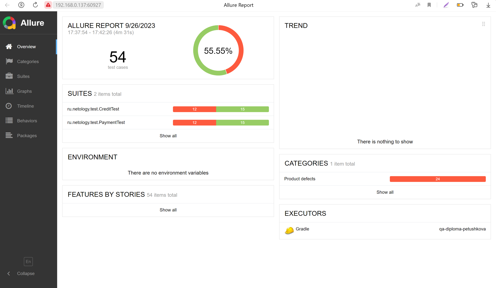

# Отчёт по итогам тестирования
Отчёт по результату автоматизированного тестирования функционала покупки тура "Путешествие дня" и оформления кредита на покупку по данным карты.

### Краткое описание.
Выполнена автоматизация тестирования веб-сервиса "Путешествие дня". В ходе тестирования были проверены:

1) Возможность оплаты двумя способами (покупка по карте и покупка в кредит);
2) Обработка ответа и демонстрация соответствующих уведомлений;
3) Выдача сообщений об ошибках при неверном заполнении формы;
4) Взаимодействие с банковскими сервисами;
5) Взаимодействие с СУБД (MySQL и PostgreSQL).

## Количество тест-кейсов
Всего было проведено 54 автотеста.
Общий процент успешных тестов равен 55,55%.
Из них успешных — 30, неуспешных — 24. 
Количество успешных и неуспешных сценариев не зависит от типа подключенной СУБД.

### Общие рекомендации
1) Устранить найденные [ошибки](https://github.com/NadezhdaPetushkova/qa_diploma/issues)
2) Добавить в код страницы специально подготовленные CSS атрибуты для тестирования (data-test-id)
3) Подсказки об ошибках при заполнении полей формы должны быть более информативные и приведены к единому формату
